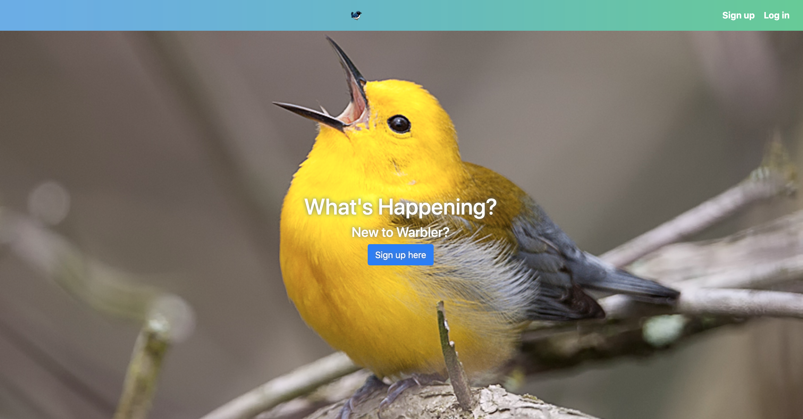
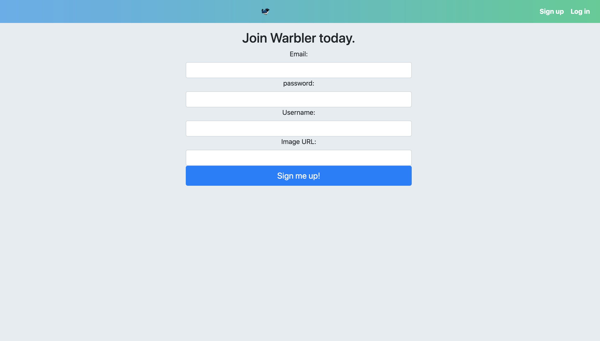

# WarblerA
## Summary
This poject is a site simular to twitter.

## Usage

When you open the application you will start on the landing page below:

Once you click on "Sign Up" it will take you to the sign in screen where you can then view, create comments! 

Home Page

## Architecture 

The pages in this app are built with HTML5, CSS3, JavaScript,and Bootstrap 4. I used jQuery, NodeJS, and ExpressJS to handle requests with MongoDB as my DB. Authentication with username and password is used to make it so only the user can create, edit, or delete comments.

## About

Everyone can create an account and then will be able create and review different comments. Only users can modify their own comments after created.

## Running locally
Steps to run:
(insure you have mongo installed on yoru machine)
- Start the mongo damon : `mongod`
- run `npm install` to restore all the nessesary packages
- Inside the project directory type `node app.js` to start the project
- Open your URL and Port in a new browser

